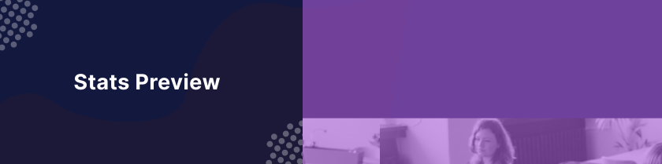

# Stats Preview

Este projeto foi realizado através do [Frontend Mentor](https://www.frontendmentor.io) que, proporciona desafios diários para que você possa melhorar a sua habilidade de codar com projetos realistas. Neste projeto o desafio era criar um componente visualmente fiel ao que foi desenhado.

## 

**Para este desafio, decidi utilizar SASS para estilizar o projeto.**